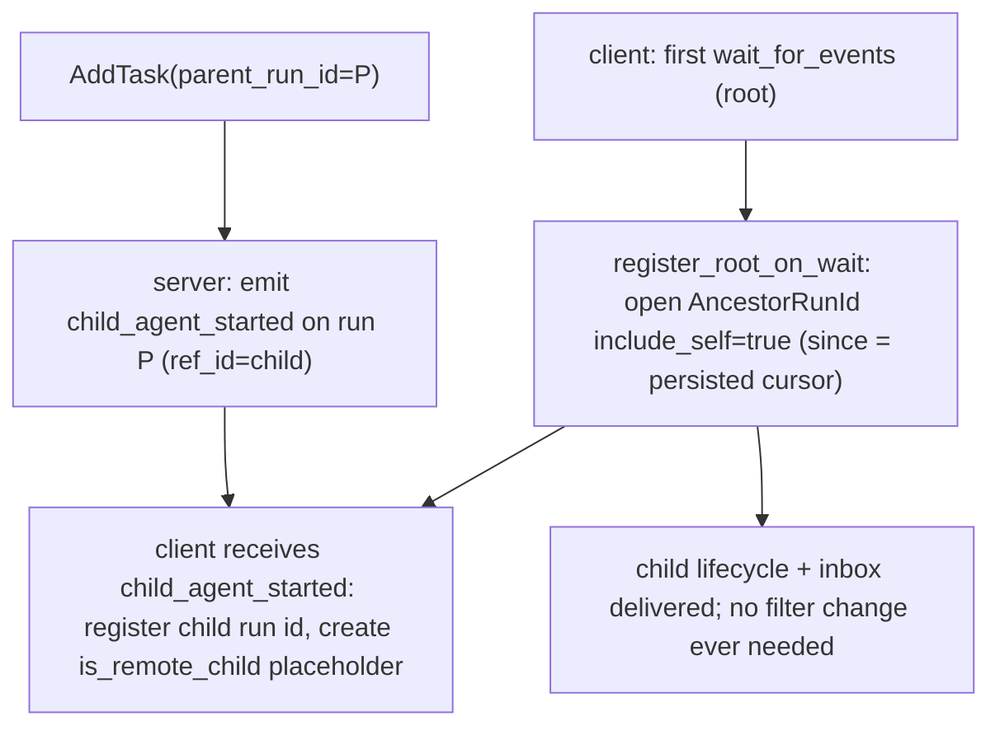
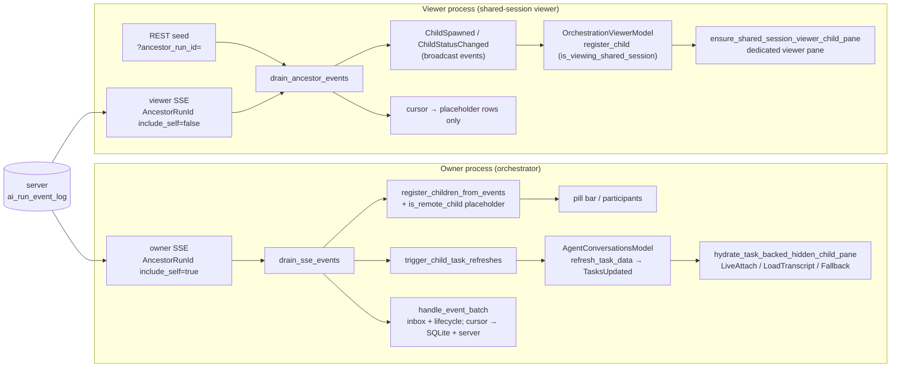
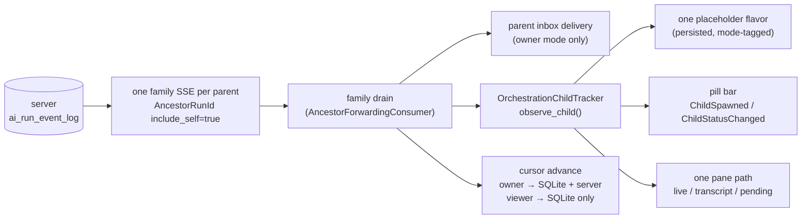
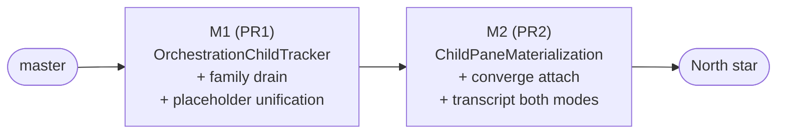

# TECH: Orchestration Child Tracking — `child_agent_started` Push Discovery (Phase 0) and Unification Roadmap (Phases 1–3)

Linear: QUALITY-928 — Emit a `child_agent_started` event so parents discover
children via push, and remove orchestration child-discovery polling.
Follow-up to QUALITY-919 (PR #13208), whose spec sketched this work under
"Always-on child discovery (lazy listening at first wait)".

## 1. Scope and status
This document is the single spec for orchestration child tracking. It covers:
- **Phase 0 — lands in the initial PR** (branch
  `matthew/child-agent-started-events`, base `origin/master`): push-based
  child discovery via `child_agent_started`, owner-side representation of
  out-of-band children, the remote-child pane hydration fix, event-driven
  refresh replacing the polling timer, and the self-heal, kill-tombstone,
  and stall-recovery guards. §3 specifies it; §4 documents the resulting
  runtime architecture. The whole owner-side feature is dogfood-gated
  (§3.3).
- **Phases 1–3 — the unification roadmap** (unscheduled): collapsing the
  owner and viewer child-tracking stacks onto one tracker, one placeholder
  flavor, one pane path, and one ancestor stream per parent. §5–§11.

The server-side emit (S1–S4, §3.2) is a separate warp-server PR against
`develop`; it is additive and safe to ship first. End-to-end manual
validation of Phase 0 requires it. Pinned research SHAs: warp `c0902a2`,
warp-server `029c643`, warp-proto-apis `ac1af73`. No `warp-proto-apis` change
is needed: event types are Go string constants surfaced via `openapi.yaml`,
and the client deserializes generically into `AgentRunEvent` (the child id
rides in `ref_id`).

A reader should come away with: (a) a working mental model of how child
agents are discovered, represented, and shown, on both the owner and viewer
sides; (b) what the initial PR changes and why; and (c) the target
architecture and the phased, flag-gated path to it.

## 2. Background: concepts and vocabulary
- **Run / task**: a server-side agent run (`ai_tasks` row), identified by a
  `run_id` (stringified `AmbientAgentTaskId`). Client-side, an
  `AIConversation` may be linked to a run via `run_id`/`task_id`.
- **Parent / child**: a child run has `parent_run_id = P`. **One-level-tree
  invariant** (carried from QUALITY-919, load-bearing): a run is either a
  root orchestrator or a leaf child; the server ancestor query is
  single-level (`parent_run_id = $1`), consistent end-to-end. Revisit
  alongside the server query if multi-level trees are introduced.
- **Owner vs viewer**: the *owner* process hosts the orchestrator
  conversation (local root, or the cloud worker's driver) — it consumes the
  parent's inbox and is the authoritative writer of the server-side event
  cursor for its run. A *viewer* passively watches an orchestrator owned
  elsewhere via a shared session; it must not push the server cursor.
- **Event log + SSE**: the server keeps an append-only `ai_run_event_log`
  with a monotonic global `sequence`, a publish path
  (`PublishLifecycleEvent` → `publishAgentRunEvent`), and an SSE handler
  with `RunIds([...])` and `AncestorRunId { ancestor_run_id, include_self }`
  filters whose ancestor query JOINs the children's `parent_run_id`
  (`include_self` adds the parent's own events). Children are created (any
  path: `run_agents`, Oz CLI, web API) through one funnel, `AddTask`.
  Relevant server code @ 029c643: `logic/ai/ambient_agents/add_task.go`
  (348-388, the child insert), `logic/agent_lifecycle.go` (13-81, event-type
  constants + `PublishLifecycleEvent`), `logic/agent_event_publish.go`
  (14-79, payload + PubSub), `model/ai_run_event_log.go` (35-120,
  `InsertEvent` + ancestor JOIN).
- **Cursor**: each consumer tracks the last fully-handled `sequence` and
  resumes SSE from it (`since=`). Owner-side it is per-conversation
  (`ConversationStreamState::event_cursor`), persisted to SQLite and pushed
  to the server; viewer-side it is per-orchestrator
  (`OrchestratorStreamState::event_cursor`), persisted to each viewer
  placeholder row but **not** pushed to the server.
- **Placeholder flavors**: a child that is not a local conversation is
  represented by a placeholder `AIConversation` in one of two flavors:
  - `is_remote_child` (owner-side): **persisted** in `AgentConversationData`
    (`crates/persistence/src/model.rs:1196`), alongside
    `parent_conversation_id`, `parent_agent_id`, `run_id`, `agent_name`.
  - `is_viewing_shared_session` (viewer-side): **runtime-only** — the flavor
    is a constructor argument (`AIConversation::new(true, ...)`) and is not
    written to `AgentConversationData`, so viewer children do not survive
    restart (§6, item 3).
- **Owner-side child kinds.** Not every owner-side child is out-of-band:
  1. *Local in-band children* (`run_agents` local execution): real
     conversations running in this process with real hidden terminal panes —
     not placeholders. Each also holds its own child-role SSE
     (`RunIds([self])`) for its inbox.
  2. *Cloud in-band children* (`run_agents`/`start_agent` with cloud
     execution): started by this process. The `StartAgentExecutor` creates an
     `is_remote_child` placeholder up-front and stamps the run id via
     `assign_run_id_for_conversation` when the server responds.
  3. *Out-of-band cloud children* (Oz CLI, web API, another client):
     discovered only via `child_agent_started`/lifecycle events; the
     discovery path (§3.4) creates the same `is_remote_child` flavor.
  Kinds 2 and 3 converge on one representation and one hydration path — the
  discovery machinery only *creates* for kind 3, but refetch and pane
  hydration serve both. Kind 1 is deliberately different (§9.4).

## 3. Phase 0 — what the initial PR lands
**Behavioral contract.** Whenever a child task is created with
`parent_run_id = P` (by any method), a parent client watching `P` discovers
that child within one SSE round-trip — no polling — and surfaces its
subsequent lifecycle and inbox events. Out-of-band children render as named
child pills (not "Unknown agent") with their inbox messages attributed
correctly, and clicking a remote-child pill hydrates its pane (live session
join while running; transcript once terminal).

### 3.1 Precondition: orchestration flags removed
`origin/master` (the PR base) already deletes the fully-rolled-out
`OrchestrationViewerStreamer` and `OwnerOrchestrationAncestorStreamer`
feature flags along with the legacy viewer REST poller, so the parent's
`AncestorRunId { include_self: true }` filter selection is unconditional.
The third rolled-out orchestration flag, `RunAgentsTool`, is being removed
in a separate change: unlike the streamer flags its removal is not a local
code collapse — the flag drives `RequestSettings.SupportsOrchestrate`
negotiation (wire-visible) and its off-branch is the legacy
`start_agent`/`start_agent_v2` flow.

### 3.2 Server: emit `child_agent_started` (separate warp-server PR)
**S1 — event-type constant.** In `logic/agent_lifecycle.go`, alongside the
existing `LifecycleEvent*` constants:
```go
const (
	LifecycleEventRunInProgress = "run_in_progress"
	// ... existing constants unchanged ...
	LifecycleEventRunCancelled  = "run_cancelled"

	// EventChildAgentStarted is emitted on a PARENT run when a child task is
	// created with parent_run_id = <parent>. The child run id is carried in
	// ref_id. This is a discovery signal, not a run status.
	EventChildAgentStarted = "child_agent_started"
)
```
**S2 — emit after the child is committed.** In `AddTask`
(`logic/ai/ambient_agents/add_task.go`) the child row is inserted inside
`database.TransactionWithNoResult(...)`. Add the emit *after* that block
returns successfully, next to the other post-commit side effects:
```go
// Notify the parent (if any) that a child was created so its client discovers
// the child via push instead of polling. Emitted on the PARENT run with the
// child run id in ref_id. Best-effort: a failure must not fail child creation.
// Placed after the commit because PublishLifecycleEvent both inserts and
// publishes and must not run inside the caller's transaction.
if params.ParentRunID != nil && *params.ParentRunID != "" {
	if _, err := logic.PublishLifecycleEvent(
		ctx,
		td.db,
		td.datastores,
		*params.ParentRunID,          // run_id the event is recorded on
		nil,                          // execution_id: the parent has none here
		logic.EventChildAgentStarted, // event_type
		&task.ID,                     // ref_id: the new child run id
	); err != nil {
		log.Warnf(ctx, "Failed to emit %s on parent %s for child %s: %v",
			logic.EventChildAgentStarted, *params.ParentRunID, task.ID, err)
	}
}
```
`PublishLifecycleEvent` inserts into `ai_run_event_log` (assigning the
monotonic `sequence`) and publishes to PubSub/SSE. Its
`resolveParentRunIDForPublish` looks up the *parent's own* parent for
routing metadata, which is `nil` under the one-level-tree invariant.

**S3 — document the type** in the events schemas in
`public_api/openapi.yaml`.

**S4 — tests.** In the `AddTask` suite, inject a mock via
`getEventPubSubClient` and assert: a task created with `ParentRunID` set
produces exactly one published event with `event_type=child_agent_started`,
`run_id=<parent>`, `ref_id=<child>`; a task with `ParentRunID` nil produces
none. Verify the event surfaces on both a `run_ids=[P]` stream and an
`ancestor_run_id=P&include_self=true` stream.

No schema/migration changes: the event lives on the parent run in the
existing log, so both filter shapes deliver it. **No server feature flag**:
the event is additive; old clients ignore unknown `event_type` values
(`lifecycle_event_type_from_wire` returns `None`; the cursor still advances
harmonlessly). Consumption is gated client-side.

**S5 — emit `run_session_linked` when a sandbox session links** (also in the
warp-server PR). In `updateSharedSessionLink`
(`logic/ai/ambient_agents/execution.go`), after the commit, best-effort emit
on the **child** run (session UUID in `ref_id`):
```go
if sharedSessionUUID != nil {
    if _, emitErr := logic.PublishLifecycleEvent(
        ctx, db, td.datastores,
        runID, nil, logic.EventRunSessionLinked, sharedSessionUUID,
    ); emitErr != nil {
        log.Warnf(ctx, "Failed to emit %s for run %s: %v",
            logic.EventRunSessionLinked, runID, emitErr)
    }
}
```
Old clients ignore this via the `_ => None` catch-all. The session UUID in
`ref_id` is an optimization (clients could extract it directly), but Phase 0
consumption triggers a coalesced metadata refetch via `refresh_task_data`
instead, reusing the existing fetch path. The event surfaces on the child's
run in both owner (`include_self=true`) and viewer (`include_self=false`)
ancestor streams.

### 3.3 Client: open the family stream at first wait
A root orchestrator becomes stream-eligible in two ways: by having watched
children — the `StartAgentExecutor` registers every in-band child via
`register_watched_run_id` at spawn time, and the post-restore fetch installs
`task.children` — or, behind `FeatureFlag::WaitForEventsParentRegistration`,
at its first `wait_for_events`, before any child exists
(`app/src/ai/blocklist/orchestration_event_streamer.rs`,
`register_root_on_wait`):
```rust
pub fn register_root_on_wait(&mut self, conversation_id: AIConversationId, ctx: ...) {
    if !FeatureFlag::WaitForEventsParentRegistration.is_enabled() { return; }
    // guards: not a child (one-level tree), not a passive remote-run view,
    // has a self_run_id ...
    let stream = self.streams.entry(conversation_id).or_default();
    if stream.ancestor_on_wait { return; }
    stream.ancestor_on_wait = true;
    stream.watched_run_ids.insert(self_run_id);
    self.reevaluate_eligibility(conversation_id, ctx);
}
```
`is_eligible` treats a wait-registered root (`ancestor_on_wait`) as having
an orchestration role, and `desired_sse_filter` selects
`AncestorRunId { ancestor_run_id: self_run_id, include_self: true }` — one
connection carrying the parent's own inbox (`new_message`), child lifecycle
events, and `child_agent_started`. The call site is
`wait_for_events.rs::execute`. The method does **no network fetch**
(replacing QUALITY-919's per-wait `get_ambient_agent_task`).

**Design decision — open the superset stream up front.** The QUALITY-919
follow-up sketched opening a cheap `RunIds([self])` stream and *upgrading*
to the ancestor filter on the first `child_agent_started`. That introduces a
cursor-handoff gap: the per-conversation `event_cursor` is a single scalar
over the *global* sequence space, but a self stream only delivers run-`P`
events, so a parent-self event can advance the cursor past a lower-sequenced
child event the narrow filter never delivered; the ancestor reconnect then
resumes from the advanced cursor and skips it. Opening the ancestor
(superset) stream from the start means the filter never widens, so the
cursor always covers the full watched set. The cost — a childless waiting
root holds a JOIN stream rather than a run-ids stream — is one idle SSE
either way. Consequence: `child_agent_started` is a discovery-latency
optimization, not a correctness-critical upgrade trigger; a child created
during an already-blocked wait before the stream opens is caught by replay
from the cursor when it connects (self-healing).

**Gating.** The whole owner-side feature is behind
`WaitForEventsParentRegistration` (dogfood-only, reused from #13208 since it
gates exactly this trigger; redefining its unshipped meaning is safe) — both
the wait-time registration *and* the consumption steps (§3.4–3.5's
discovery, placeholder creation, self-heal, and refetch each early-return
when the flag is off). Gating consumption matters because a
`run_agents`/restore parent holds an open ancestor stream even with the
flag off; without consumption gates the new machinery would ship ungated to
production the moment the server starts emitting. Off ⇒ behavior identical
to the pre-branch baseline: roots discovered only via `run_agents`/restore,
`ancestor_on_wait` never set, and drained events feed only delivery.

**None-handling and timing (as-built).** When a parent or wait-root has no
`self_run_id` yet, `desired_sse_filter` returns `NoFilter` (with a warn) and
defers until `on_server_token_assigned` re-evaluates. `register_root_on_wait`
similarly requires `self_run_id` and relies on a later wait to re-check;
`on_server_token_assigned` does not retro-register. Safe in practice because
the run id arrives via StreamInit / task creation before the model can emit
any tool call.

### 3.4 Client: consume the event; represent out-of-band children
The drain pipeline (§4.2) calls `register_children_from_events` on every
batch: each `child_agent_started` inserts `ref_id` (the child run id) into
`watched_run_ids` — flipping `is_parent_agent_conversation` true, with no
reconnect since the ancestor filter's shape is unchanged; unparseable
`ref_id`s are rejected before registration so garbage cannot flip the
parent role — and, for children with no local conversation, creates an
owner-side representation:
- **Fetch-first placeholder creation.** `ensure_remote_child_placeholder`
  fetches task metadata, then `finish_remote_child_placeholder` creates the
  placeholder from it: `start_new_child_conversation`,
  `mark_conversation_as_remote_child` (so `is_remote_run_view` is true and
  the streamer opens no redundant per-child SSE — the child's events already
  arrive on the parent's `include_self` stream; `is_remote_child`, NOT
  `is_viewing_shared_session`, which would mislabel it), fallback display
  title from `task.title`, and `assign_run_id_for_conversation` so
  `conversation_id_for_agent_id` resolves (pill appears; inbox messages
  attribute to the child).
- **Self-heal from lifecycle events.** A fetch can fail, and
  `child_agent_started` is one-shot — so `drain_sse_events` also calls
  `ensure_placeholders_for_child_lifecycle_events`: any child lifecycle
  event whose child still has no local conversation re-attempts placeholder
  creation. This also covers a child whose first observed signal is a
  lifecycle event (e.g. a stream opened after the `child_agent_started`
  sequence). A per-child in-flight guard
  (`remote_child_placeholder_fetches`) prevents overlapping fetches; guard
  entries age out after 30s because the request layer has no per-call
  timeout, so a hung fetch cannot block the child's representation forever.
  The post-restore fetch also runs placeholder creation for installed
  children with no local conversation — a crash between cursor persistence
  and placeholder creation would otherwise leave a watched child with no
  pill, and a terminal child emits no further lifecycle events for
  self-heal to catch.
- **Killed-run tombstones.** Discovery and refetch skip runs in
  `killed_run_ids`, and `ensure_remote_child_placeholder` refuses them at
  the creation chokepoint — necessary because these steps run *before*
  `handle_event_batch`'s delivery-side killed filter, so a late lifecycle
  event for a locally-killed child would otherwise resurrect its
  placeholder. The tombstones are re-checked *after* the metadata fetch
  await too (`finish_remote_child_placeholder`): a kill landing mid-fetch
  (stamp → kill → delete clears the agent-id index) must not be resurrected
  by the callback. A spawn that races a cancellation tombstones its run id
  at `TaskSpawned` for the same reason — the id was never stamped locally,
  so the duplicate-representation guard alone cannot catch it.
- **Duplicate-representation guard + race reconciliation.** The server emits
  `child_agent_started` for every child, including in-band ones that already
  have a conversation; placeholder creation is gated on
  `conversation_id_for_agent_id(child_run_id).is_none()` (re-checked in the
  fetch callback). For the event-before-stamp race,
  `assign_run_id_for_conversation` (`history_model.rs:1377`) drops a stale
  `is_remote_child` placeholder when a locally-started child claims the same
  run id, so a child never ends up with two conversations.



### 3.5 Client: pane hydration + event-driven refresh
**Hydration (click).** Clicking a remote-child pill routes through
`create_hidden_child_agent_pane`'s `is_remote_child` branch into
`hydrate_task_backed_hidden_child_pane`
(`app/src/pane_group/child_agent/hydration.rs`), dispatching on a pure
decision function over the fetched `AmbientAgentTask`:
```rust
pub(in crate::pane_group) enum RemoteChildHydrationAction {
    /// Attachable live session — join it in place.
    LiveAttach { session_id: SessionId },
    /// No live session but a server conversation token is available.
    LoadTranscript { server_token: ServerConversationToken, task_is_terminal: bool },
    /// Neither live nor cloud transcript available.
    Fallback { task_is_terminal: bool },
}
```
Terminality comes from `task.is_terminal_run_state()`, not live-session
state. `LiveAttach` joins the session via `attach_execution_session` (the
pane's cloud-mode viewer terminal manager actually streams). `settles()`
gates the pending entry: `LiveAttach` always settles; transcript/fallback
settle only when terminal — a non-terminal child stays in
`pending_remote_child_hydrations` and is re-driven by
`process_pending_remote_child_hydrations` on `TasksUpdated`. The cloud
zero-state block is suppressed for `is_remote_child` conversations.

**Event-driven refresh (replaces polling).** `trigger_child_task_refreshes`
(called from the drain) refetches each child's task via
`AgentConversationsModel::refresh_task_data` on that child's lifecycle
events and on `run_session_linked` → `TasksUpdated` → re-drives pending
hydrations. `refresh_task_data` *coalesces* with any in-flight fetch — a
refresh arriving mid-fetch is recorded and one follow-up fetch issues on
completion — so the refetch carrying a state transition cannot be swallowed
by a stale request started before the transition (failure cooldowns still
apply to the follow-up). This replaced the unbounded ~3s tracked-refresh
timer approach. The `run_session_linked` event (S5) closes the
click-before-first-event window for the owner side: `child_task_ids_to_refresh`
includes it, so a child whose `session_id` links between lifecycle events
still triggers an immediate refetch rather than requiring a polling fallback.
Refetch fires for in-band and out-of-band children alike; tombstoned runs
are skipped (the pure selection is `child_task_ids_to_refresh`).

**Viewer-side changes in Phase 0.** The viewer's unbounded `session_id`
polling timer is deleted; `spawn_task_metadata_fetch` is driven event-wise —
on `ChildSpawned` and, from `handle_child_status_changed`, while a tracked
child's `session_id` is still missing or its pane isn't materialized.
`drain_ancestor_events` now also handles `run_session_linked` on a child run:
emits `ChildSpawned` on first observation, then `ChildStatusChanged` (with
`InProgress` as the signal status) to drive `spawn_task_metadata_fetch` —
replacing the former bounded polling fallback entirely.
Viewer discovery scope is otherwise unchanged: the viewer stream stays
`include_self: false`, so `child_agent_started` is not delivered to viewers
and viewer child discovery remains the child's first lifecycle event
(creation-time viewer discovery folds into Phases 1/3).

### 3.6 Phase 0 validation
Client (all landed on the branch; `cargo nextest run -p warp`, `./script/format`
and the presubmit clippy clean):
- First wait on a root opens `AncestorRunId { include_self: true }` with no
  server fetch (`streamer_with_no_fetch_expected` asserts no
  `get_ambient_agent_task`); a wait-registered root is eligible.
- `child_agent_started` registers the child and flips the parent role with
  no reconnect; duplicates and pre-registered (`run_agents`) children cause
  no churn.
- Out-of-band placeholder creation (named `is_remote_child` pill, indexed
  run id, no per-child SSE); guard for children with existing conversations;
  event-before-stamp race drops the stale placeholder.
- Self-heal: an unrepresented child's lifecycle event dispatches a
  placeholder fetch; already-represented children and the parent's own run
  are skipped. Discovery-path dispatch has the same coverage, including
  rejection of unparseable `ref_id`s.
- Killed-run tombstones block discovery, refetch
  (`child_task_ids_to_refresh` unit contract), and placeholder creation
  while live siblings on the same drain still dispatch; a kill landing
  mid-fetch is refused by the fetch callback.
- Flag off ⇒ `register_root_on_wait` is a no-op; children
  (`has_parent_agent`) and remote-run views never wait-register; and the
  consumption steps (discovery, self-heal, refetch) are inert even when
  called with events for unrepresented children.
- Refetch coalescing: a `refresh_task_data` arriving during an in-flight
  fetch is recorded and dispatches exactly one follow-up on completion.
- `run_session_linked` triggers `trigger_child_task_refreshes` owner-side
  and a `ChildStatusChanged`-driven `spawn_task_metadata_fetch` viewer-side;
  self/killed filters apply as for lifecycle events.
- Unknown `event_type` is ignored and advances the cursor (forward compat).
- Hydration: `decide_remote_child_hydration_action` contract (attachable →
  `LiveAttach`; terminality from run state; empty tokens → `Fallback`);
  `settles()` matrix; viewer model rewritten to the event-driven path.

Manual (dogfood, flag on, with the server PR deployed): create a child via
the Oz CLI/web API with `parent_run_id`, have the parent `wait_for_events`;
verify the child surfaces without polling cadence and appears as a named
pill with attributed messages. Click a child pill early (Queued/Pending),
mid-run, and after completion — expect re-drive → live join → transcript
respectively (§4.5). Verify the viewer pill bar still populates.

## 4. Architecture after Phase 0: the two stacks
### 4.1 At a glance

Both stacks live in `app/src/ai/blocklist/orchestration_event_streamer.rs`
(one model, two disjoint state maps): owner state in
`streams: HashMap<AIConversationId, ConversationStreamState>`, viewer state in
`viewer_mode_orchestrators: HashMap<AmbientAgentTaskId, OrchestratorStreamState>`.

### 4.2 Owner-side stack
Stream open per §3.3. A 500ms timer drains buffered events
(`drain_sse_events`):
```rust
self.register_children_from_events(conversation_id, &events, ctx);      // discovery
let self_run_id = self.self_run_id(conversation_id, ctx).unwrap_or_default();
self.trigger_child_task_refreshes(&self_run_id, &events, ctx);          // refetch
self.ensure_placeholders_for_child_lifecycle_events(                    // self-heal
    conversation_id, &self_run_id, &events, ctx);
self.handle_event_batch(conversation_id, &self_run_id, cursor, events, messages, ctx);
```
- **Discovery / self-heal / tombstones** per §3.4.
- **Refetch** per §3.5.
- **Delivery** (`handle_event_batch`): advances + persists the cursor
  (SQLite and, for the owner, the server), drops killed-run events, converts
  lifecycle events, and enqueues inbox messages and lifecycle items into
  `OrchestrationEventService` — which delivers them to the parent's model as
  `AIAgentInput::MessagesReceivedFromAgents` /
  `AIAgentInput::EventsFromAgents` (LLM inputs; `orchestration_events.rs`,
  `drain_and_convert_events`). Note what this path does *not* do: nothing
  here writes a child placeholder's `ConversationStatus`. Owner-side
  cloud-child pill status is corrected only opportunistically when the
  child's pane attaches (ambient-view priming), and can lag otherwise — see
  §6, item 3. Note also the ordering: discovery/refetch/self-heal run
  *before* this step's killed-run filter, which is why they consult the kill
  tombstones themselves (§3.4).

Pane hydration per §3.5.

### 4.3 Viewer-side stack
**Registration.** Each viewer pane owns an `OrchestrationViewerModel`
(`terminal/shared_session/viewer/orchestration_viewer_model.rs`). It
registers with the streamer only when the pane's active conversation is the
orchestrator's `is_viewing_shared_session` parent placeholder
(`register_viewer_mode_consumer_if_possible`). Registration is refcounted
per `parent_task_id` (`register_viewer_mode_consumer`).

**Seed + stream.** First registration issues a one-shot REST seed
(`?ancestor_run_id=`, limit 100) that populates `known_children` and the
cursor; only then does the ancestor SSE open (`start_ancestor_sse`) with
`include_self: false` — the viewer never needs the parent's inbox.

**Drain → broadcasts.** `drain_ancestor_events` drops `new_message`
outright, emits `ChildSpawned` exactly once per run id (deduped via
`known_children`, pre-seeded so reconnect replay is quiet) and
`ChildStatusChanged` per lifecycle event, then persists the cursor to every
registered viewer placeholder — but not to the server
(`persist_event_cursor`'s viewer-mode short-circuit).

**OVM consumption.** `handle_child_spawned` → `spawn_task_metadata_fetch` →
`register_child`, which creates the `is_viewing_shared_session` placeholder
(name, fallback title, harness, run id index, status) and — once a
`session_id` is known — emits `EnsureSharedSessionViewerChildPane`.
`handle_child_status_changed` writes status through and refetches metadata
while `session_id` is still missing or the pane isn't materialized: the
event-driven claim-time wait the owner side now mirrors.

**Pane materialization.** `ensure_shared_session_viewer_child_pane`
(`pane_group/child_agent/restoration.rs`) builds a dedicated shared-session
viewer pane with its own `BlocklistAIController` and viewer `Network`,
swapping out the loading placeholder a too-early pill click may have left.
There is **no terminal-transcript branch**: a viewer child without a live
`session_id` never materializes beyond the loading state.

### 4.4 Duplication map
| Concern | Owner-side | Viewer-side (OVM) |
| --- | --- | --- |
| Discovery | `register_children_from_events` (`child_agent_started` + lifecycle self-heal) | REST seed + `ChildSpawned` from `drain_ancestor_events` |
| Claim-time wait for `session_id` | `trigger_child_task_refreshes` (coalesced) + bounded click fallback | `ChildStatusChanged` → `spawn_task_metadata_fetch` + bounded pre-claim fallback |
| Placeholder conversation | `is_remote_child` (persisted) | `is_viewing_shared_session` (runtime-only) |
| Placeholder creation | `finish_remote_child_placeholder` | `register_child` |
| Attach live session | `LiveAttach` → `attach_execution_session` on a cloud-mode ambient pane | `EnsureSharedSessionViewerChildPane` → dedicated viewer pane |
| Terminal transcript | `LoadTranscript` (terminal only) | none |
| Ancestor SSE | `streams` (`include_self=true`, inbox + discovery + cursor→server) | `viewer_mode_orchestrators` (`include_self=false`, lifecycle only, cursor local) |
| Broadcast events | none (drain feeds `handle_event_batch` directly) | `ChildSpawned` / `ChildStatusChanged` |

The streamer already flags the intended convergence: `OrchestratorStreamState`
notes "Today the only consumers are shared-session viewer panes … See the note
on `AncestorForwardingConsumer` for the future direction", and
`AncestorForwardingConsumer`'s doc sketches exactly the single-family-stream
generalization in §7.

### 4.5 Empirical grounding (why the owner pieces exist)
Validated against a healthy session-sharing server by clicking a child pill
at three lifecycle moments:
- **Early click (Queued/Pending)**: the child is not attachable for ~10s;
  the pane must re-drive as the task advances (Pending → Claimed →
  InProgress+Attachable). A refetch mechanism is genuinely required even
  with a healthy server, because `child_agent_started` fires at task
  creation.
- **Running click**: a single immediate `LiveAttach`, no fallback churn.
- **Completed click**: a single terminal `LoadTranscript`.

Conclusions applied in Phase 0: non-terminal `LoadTranscript` was not
observed empirically (its reload guard was removed; the decide function can
still return it when a token exists without an attachable session, in which
case the unsettled re-drive re-loads — see `settles()`); `LiveAttach`
session-join and terminal `LoadTranscript` are essential; the refresh
mechanism is load-bearing for the early-click window (now event-driven).

## 5. Differences that block naive reuse
1. **Consumer gating.** OVM registers only in the `is_viewing_shared_session`
   viewer context; the owner is not viewing a shared session, so OVM is inert
   for it. §3.4's owner-side representation exists precisely to fill that gap.
2. **Placeholder flavor.** `is_remote_child` vs `is_viewing_shared_session`
   drive different branches of `create_hidden_child_agent_pane`. (Server
   status reporting is *not* a differentiator: `LocalAgentTaskSyncModel`
   skips both flavors.)
3. **Persistence asymmetry.** `is_remote_child` is persisted; the viewer
   flavor is not (§2). Any unification must decide the on-disk story.
4. **Broadcast events are viewer-only.** `ChildSpawned`/`ChildStatusChanged`
   are emitted only by `drain_ancestor_events`; the owner drain feeds
   `handle_event_batch` directly.
5. **Two ancestor SSEs with different wire filters and cursor authority.**
   Owner: `include_self=true`, needs `new_message`, pushes the server cursor.
   Viewer: `include_self=false`, drops `new_message`, local cursor only.
6. **Pane materialization differs.** Owner reuses the cloud-mode ambient pane
   + `attach_execution_session`; viewer builds a dedicated viewer pane with
   its own `Network`. Only the owner has a terminal-transcript path.

## 6. Why unify (the value)
1. **Duplication and drift.** Six near-identical concerns (§4.4) implemented
   twice, in one file plus two pane paths. Each fix must be discovered and
   applied twice; the Phase 0 work is itself evidence — the owner side had
   to re-grow refetch, self-heal, and placeholder logic OVM already had, and
   initially shipped without the self-heal (the "Unknown agent on failed
   fetch" gap, fixed later on the same branch).
2. **Two ancestor SSE connections per parent** when an owner and a viewer run
   in the same process family (and always two server-side query shapes to
   maintain). One JOIN-backed stream per parent family is strictly cheaper
   and removes a whole class of "which stream saw it first" reasoning.
3. **Capability gaps are side-of-origin accidents, not decisions.**
   - The **restore-after-restart bug**: a `/cloud-agent` shared-session parent
     restores without its children — no pills, children render as "Unknown
     agent" — because viewer placeholders are runtime-only (§2) and OVM's
     registration precondition isn't re-established on restore. The owner
     flavor survives restart; the viewer flavor does not.
   - The **terminal-transcript gap**: clicking a finished child works
     owner-side (`LoadTranscript`) but dead-ends viewer-side (loading
     placeholder forever), because only one stack grew the branch.
   - The **owner-side pill-staleness gap**: viewer children get
     `ConversationStatus` writes from OVM, but owner-side cloud-child
     placeholders have *no event-driven status writer at all* — lifecycle
     events are consumed as LLM inputs (§4.2 Delivery), and
     `LocalAgentTaskSyncModel` is outbound-only and skips remote children.
     The pill bar reads `conversation.status()`, so an owner's cloud-child
     pill can sit at its creation status until the child's pane is opened.
4. **Bespoke machinery outlives its cause.** The pending/settle re-drive
   (`pending_remote_child_hydrations`, `settles()`, bounded fallback) exists
   because the owner pane path can be entered before task data is complete.
   The viewer path solves the same window with claim-time refetch + a single
   materialization gate. One pane path needs only one such mechanism.
5. **Reviewability.** `orchestration_event_streamer.rs` is ~2600 lines
   hosting two parallel pipelines with different key types, cursor rules,
   and event contracts. Collapsing them is the single biggest lever on
   comprehension and future orchestration work (e.g. multi-level trees would
   today need to be implemented twice).

## 7. North star architecture
### 7.1 Overview
One of each mechanism:
- **One discovery signal**: `child_agent_started` (creation-time) plus child
  lifecycle events as the self-healing backstop, consumed identically for
  owner and viewer.
- **One ancestor stream per parent family**: a single
  `AncestorRunId { include_self: true }` SSE whose drain fans out by event
  kind — parent inbox to the owner's inbox consumer, discovery/lifecycle to
  the child tracker — while respecting cursor authority. This is the
  `AncestorForwardingConsumer` generalization the code already anticipates.
- **One child tracker**: an `OrchestrationChildTracker` owning discovery,
  claim-time refetch, placeholder creation, and materialization requests for
  both modes.
- **One placeholder flavor**: a single persisted conversation kind with a
  mode tag, fixing the viewer restore bug by construction.
- **One pane path**: a single materialization function with live-session,
  terminal-transcript, and pending branches.
- **Refresh**: event-driven with a bounded fallback (already true after
  Phase 0 on both sides).



### 7.2 `OrchestrationChildTracker` (sketch)
Extract OVM's core into a model keyed on the orchestrator, running in both
modes. The mode captures the only real behavioral differences:
```rust
/// How this process relates to the orchestrator whose children are tracked.
enum ChildTrackingMode {
    /// This process owns the orchestrator run: consume the parent inbox and
    /// authoritatively push the server-side event cursor.
    Owner { orchestrator_conversation_id: AIConversationId },
    /// Passive view of an orchestrator owned elsewhere: lifecycle only;
    /// cursor persisted locally, never pushed to the server; server-side
    /// status reporting suppressed on placeholders.
    Viewer { placeholder_conversation_id: AIConversationId },
}

struct TrackedChild {
    conversation_id: AIConversationId,   // the unified placeholder
    session_id: Option<SessionId>,       // None until claim time
    last_state: AmbientAgentTaskState,
    pane_materialized: bool,
}

pub struct OrchestrationChildTracker {
    parent_task_id: AmbientAgentTaskId,
    mode: ChildTrackingMode,
    children: HashMap<AmbientAgentTaskId, TrackedChild>,
    children_by_run_id: HashMap<String, AmbientAgentTaskId>,
    /// In-flight metadata fetches (today's `remote_child_placeholder_fetches`
    /// and OVM's dispatch guard, unified).
    metadata_fetches: HashSet<String>,
}

/// Every way a child can become known funnels into one entry point.
enum ChildSignal {
    Started,                                  // child_agent_started (ref_id)
    Lifecycle(api::LifecycleEventType),       // any recognised lifecycle event
    Seeded(AmbientAgentTask),                 // REST seed / restore fetch row
    /// Created by this process (run_agents / start_agent): the executor
    /// registers the child it just made, with its existing conversation.
    Registered { conversation_id: AIConversationId },
}

impl OrchestrationChildTracker {
    fn observe_child(&mut self, child_run_id: &str, signal: ChildSignal, ctx: ...) {
        // 0. drop tombstoned (locally killed) runs, and runs owned by a
        //    non-placeholder local conversation (local in-band children)
        // 1. ensure placeholder exists (create-or-update; self-healing by
        //    construction since every signal funnels here)
        // 2. write status through on lifecycle signals (sole writer, §7.3)
        // 3. refetch metadata while session_id is missing or pane not
        //    materialized (claim-time wait)
        // 4. request pane materialization once session_id is known, or a
        //    transcript view once terminal (§7.5)
    }
}
```
This subsumes, on the owner side: `register_children_from_events`'s
placeholder work,
`ensure_remote_child_placeholder`/`finish_remote_child_placeholder`,
`ensure_placeholders_for_child_lifecycle_events`, and
`trigger_child_task_refreshes`; on the viewer side: `handle_child_spawned`,
`handle_child_status_changed`, `spawn_task_metadata_fetch`, `register_child`.

**Child membership has one writer.** The streamer keeps only wire concerns.
Under the family (ancestor) filter the wire shape needs just the parent's
`self_run_id` (`desired_sse_filter`'s ancestor branch already uses nothing
else), so per-child run-id sets stop being filter inputs: child membership
lives in the tracker alone, and the streamer's parent-role check and
`RunIds`-fallback derivation read tracker state instead of maintaining
`watched_run_ids` copies. `watched_run_ids` shrinks to self-inbox watching
for the legacy fallback. This avoids re-creating the dual-source-of-truth
problem §7.6's fifth item warns about.

In-band children flow through the same funnel: the `StartAgentExecutor`
registers each child it spawns (`ChildSignal::Registered`), so later
`Started`/`Lifecycle` signals for that run id are idempotent status updates
rather than placeholder creation — replacing today's implicit
`conversation_id_for_agent_id(...).is_none()` guards with explicit tracker
state. Local in-process children are observed for status only and never get
placeholders or metadata fetches (§9.4). All tracker metadata fetches route
through `AgentConversationsModel`, not raw client calls (§7.6, item 1).

**Cardinality, mode resolution, and lifetime.** One tracker per
`parent_task_id` per process, hosted in a singleton registry with refcounted
consumers — exactly the shape of today's `viewer_mode_orchestrators` entries.
OVM and the owner's agent view become thin per-pane consumers that register
and unregister. Mode is *derived*, not configured: `Owner` iff this process
hosts the orchestrator conversation; a viewer pane opened on your own run
registers as another consumer of the owner-mode tracker rather than creating
a second tracker. Owner-mode trackers live as long as the orchestrator
conversation; viewer-mode trackers tear down when the last consumer
unregisters (today's refcounting rule).

### 7.3 One family stream per parent (sketch)
The streamer keeps one connection per parent family, always
`include_self: true`, and the drain classifies rather than duplicates:
```rust
enum FamilyEvent {
    /// Event on the parent's own run: inbox message or parent lifecycle.
    ParentSelf(AgentRunEvent),
    /// child_agent_started on the parent run; child run id in ref_id.
    ChildStarted { child_run_id: String },
    /// Lifecycle event on a child run.
    ChildLifecycle { child_run_id: String, kind: api::LifecycleEventType },
    /// Unrecognised event type: advances the cursor only (forward compat).
    Opaque,
}

fn drain_family_events(&mut self, parent_task_id: AmbientAgentTaskId, ctx: ...) {
    for event in buffered {
        match classify(&event, &self_run_id) {
            // Owner mode only; a pure viewer never receives these because
            // hydration is skipped, or receives-and-drops them (see §9.2).
            FamilyEvent::ParentSelf(e) => self.deliver_owner_inbox(e, ctx),
            FamilyEvent::ChildStarted { child_run_id } =>
                tracker.observe_child(&child_run_id, ChildSignal::Started, ctx),
            FamilyEvent::ChildLifecycle { child_run_id, kind } => {
                tracker.observe_child(&child_run_id, ChildSignal::Lifecycle(kind), ctx);
                ctx.emit(ChildStatusChanged { .. });   // pill bar, both modes
            }
            FamilyEvent::Opaque => {}
        }
    }
    // Cursor authority: one scalar per family stream.
    match mode {
        Owner { .. }  => self.persist_cursor_local_and_server(max_seq, ctx),
        Viewer { .. } => self.persist_cursor_local_only(max_seq, ctx),
    }
}
```
Message hydration becomes an opt-in on the forwarding consumer (exactly the
flag `AncestorForwardingConsumer`'s doc comment anticipates), enabled in owner
mode and disabled in viewer mode.

**Single status writer.** The tracker is the sole writer of placeholder-child
`ConversationStatus` in both modes. This is not just tidiness: it *fixes* the
owner-side pill-staleness gap (§6, item 3) — today no one writes owner-side
cloud-child status from events. The broadcasts are notifications for views,
never a license for consumers to write status. Local in-band children keep
their own controller as their status writer (the tracker is read-only for
them), and the `EventsFromAgents` injection path (§4.2 Delivery) is
orthogonal — it feeds the parent's model, not UI state — and is unchanged.

### 7.4 One placeholder flavor
Persist a single child-placeholder kind; keep the on-disk shape
backward-compatible by reusing the existing fields:
- Keep `is_remote_child: bool` in `AgentConversationData` as the persisted
  marker for "child placeholder without a local run" (rows written by today's
  builds already have it).
- Represent viewer-ness as a **runtime mode on the tracker**, not a persisted
  conversation flavor. Viewer-created placeholders start persisting with the
  same marker, which fixes the restore-after-restart bug. Note the viewer
  restore mechanism precisely: a pure viewer's parent is an
  `is_viewing_shared_session` placeholder that the streamer's restore path
  skips entirely (no owner restore fetch runs viewer-side), so the rebuild
  must come from the persisted placeholder rows plus `children_by_parent`
  alone — workable, but Phase 1 must not assume a `task.children` fetch.
- Server-status-report suppression keys off the tracker mode at write time
  instead of `is_viewing_shared_session()` on the conversation.
`is_viewing_shared_session` remains for the *parent* viewer placeholder (a
genuine shared-session concept); only the child-placeholder use retires.

### 7.5 One pane path
`create_hidden_child_agent_pane` collapses to a single child-placeholder
branch that dispatches on observable state, unifying today's
`decide_remote_child_hydration_action` with the viewer materialization and
adding the missing transcript branch for viewers:
```rust
enum ChildPaneMaterialization {
    /// Attachable live session: join it (both modes; the viewer variant is
    /// today's ensure_shared_session_viewer_child_pane, the owner variant is
    /// today's LiveAttach — converging these is Phase 2b's core).
    AttachLive { session_id: SessionId },
    /// Terminal run with a server conversation: load the transcript.
    LoadTranscript { server_token: ServerConversationToken },
    /// Not yet attachable: show pending state; the tracker re-drives on the
    /// next lifecycle-driven refetch.
    Pending,
}
```
`settles()`/`pending_remote_child_hydrations` disappear: "pending" is simply a
tracked child whose `pane_materialized` is false, re-driven by
`observe_child`. The local-child branch of `create_hidden_child_agent_pane`
(a real hidden terminal pane for an in-process child) is untouched: the
unified path replaces only the two placeholder branches.

### 7.6 Adjacent consolidations across all child kinds
Walking the full taxonomy (§2) surfaces four further consolidations that the
tracker makes cheap; the first three belong to Phase 1, the fourth to
Phase 3+.
1. **One task-metadata fetch authority.** Today `get_ambient_agent_task` for
   children runs through five independent paths with three different
   retry/dedup schemes: the post-restore fetch (own exponential backoff,
   `RESTORE_FETCH_BACKOFF_STEPS`), the harness fetch
   (`spawn_task_harness_fetch_if_needed`), the placeholder fetch (own
   in-flight guard), OVM's `spawn_task_metadata_fetch` (raw client, no
   dedup), and `AgentConversationsModel::async_fetch_task` — the only one
   with in-flight dedup, failure cooldowns, a cache, and a `TasksUpdated`
   signal. The tracker fetches exclusively through `AgentConversationsModel`;
   the bespoke retry/guard machinery deletes and every consumer shares one
   cache (pane hydration already reads it).
2. **One status-mapping module.** Child status exists in three
   representations — wire `event_type`, REST `AmbientAgentTaskState`, client
   `ConversationStatus` — with mirrored mappings in two files:
   `conversation_status_from_lifecycle_event_type` (streamer) documents that
   it mirrors `conversation_status_from_state` (OVM), and hydration
   separately consults `is_terminal_run_state()`. One mapping module, owned
   alongside the tracker, replaces the mirror-comment contract with a single
   function set.
3. **One cold-start seed.** The post-restore fetch
   (`finish_restore_fetch`/`apply_task_children`), the viewer REST seed
   (`finish_ancestor_seed_fetch`), and wait-time registration are all
   "cold-start: fetch children, merge cursor, install" with different
   retry and cursor-merge logic. `ChildSignal::Seeded` makes them one
   mode-agnostic seed routine (already implied by the Phase 3 scorecard's
   "seed-vs-restore duality"; the seed routine itself can unify in Phase 1).
4. **Deduplicate local-child event delivery.** With the parent's family
   stream open (`include_self=true`), every local in-band child's events are
   already delivered to this process — and delivered *again* on that child's
   own `RunIds([self])` stream (disjoint consumption: the parent takes
   lifecycle, the child takes its inbox). N local children means N+1
   connections carrying overlapping data. Folding child inbox delivery into
   the family drain collapses this to one connection — and the dormant-Claude
   wake listener becomes a drain classification case instead of a third
   connection type. Complication: each child's own per-run server cursor must
   still advance (or be explicitly retired) — see §9.2. This is the §11 open
   question, promoted to a named opportunity.
A fifth, softer one: child identity/relationship maps proliferate
(`watched_run_ids`, `known_children`, OVM's `children`/`children_by_run_id`,
`child_agent_panes`, `pending_remote_child_hydrations`, history's
`children_by_parent`/`agent_id_to_conversation_id`). The end state should
declare exactly two sources of truth — the history model (identity/linkage)
and the tracker (orchestration state) — with everything else derived.

## 8. Migration plan
**Unified north-star implementation — two-PR stack from master.** Rather
than shipping an intermediate Phase 0 layer and then layering Phases 1–3 on
top (which would require writing and then deleting ~600 lines of scaffold),
the full north-star architecture is implemented directly in two stacked PRs
behind a single `OrchestrationUnifiedStack` dogfood flag.

**M1 — Core tracker + unified stream (PR targets master).** `OrchestrationChildTracker`
(§7.2) as the sole entry point for child state; `classify_family_event` +
`drain_family_events` replacing both `drain_sse_events` and `drain_ancestor_events`
(§7.3); unified `is_remote_child` placeholder including viewer-created children
(§7.4); `ChildSignal::SessionLinked` carries the session UUID directly from
`run_session_linked` events, eliminating metadata fetches for the attach-time
window; rolled-out flag removal (`OrchestrationViewerStreamer`,
`OwnerOrchestrationAncestorStreamer`) + legacy viewer REST polling deletion.
Flag-off: behavior identical to master before this PR. Flag-on: one SSE per
parent, tracker owns all child state.

**M2 — Pane path + transcript (PR targets M1 branch).** `ChildPaneMaterialization`
(§7.5) as the single dispatch for all placeholder children; converged
`attach_child_session` for both owner and viewer (§2b's core); transcript
path for both owner and viewer (`LoadTranscript` when terminal +
`conversation_id` — authorization resolved per §9.1, server prerequisite in
warp-server PR #12252). Deletes all old dispatch machinery:
`decide_remote_child_hydration_action`, `RemoteChildHydrationAction`,
`settles()`, `pending_remote_child_hydrations`,
`process_pending_remote_child_hydrations`, `hydrate_task_backed_hidden_child_pane`,
`live_attach_ambient_session_to_pane`, `ensure_shared_session_viewer_child_pane`.



### Flag-gating strategy
- **One flag (`OrchestrationUnifiedStack`)** gates the entire system. Flag-off
  preserves exact master baseline; flag-on is the full north-star. No
  intermediate states to maintain.
- **Persisted format is forward-compatible**: `is_remote_child = true` rows
  written by the new system are treated as owner-side pills by old builds
  (click-through degrades gracefully per §9.3). The flag only controls whether
  viewer-created rows are written; the encoding is unchanged.
- **`WaitForEventsParentRegistration`** is preserved in M1 (it guards the
  `register_root_on_wait` mechanism used by the flag-off path) but superseded
  by `OrchestrationUnifiedStack` when the flag is on. Promote/remove it
  separately after `OrchestrationUnifiedStack` is fully rolled out.

## 9. Hard sub-problems and design decisions
### 9.1 Terminal child transcript (Phase 2a)
The viewer path materializes only on a live `session_id`. Clicking a finished
child must show its transcript; the unified path adds the transcript branch
(terminal + `conversation_id`, no live session) — additive to OVM and
effectively the surviving piece of today's `LoadTranscript`. The empirical
contract (§4.5) is the acceptance test.

**Authorization (resolved).** Policy decision: if a user has access to view
a parent orchestrator session, they have access to view the transcripts of
that session's direct children. Implementation: when a child run's conversation
object is created (in `UpsertAIConversationMetadata` or
`CreateThirdPartyConversation` in warp-server), propagate the *parent run's*
shared session ACLs to the child conversation, in addition to the child's own
session ACLs. This gives parent-session viewers `ViewAction` on child
conversation objects, making `getAndVerifyManifest`'s `ViewAction` check
pass for them. The server change is a prerequisite for Phase 2a's viewer
transcript branch. Client-side: both owner and viewer modes return
`LoadTranscript` from the unified dispatch when the run is terminal and a
`conversation_id` exists.

### 9.2 One stream serving inbox + lifecycle with split cursor authority (Phase 3)
The owner needs `include_self=true` + hydrated `new_message` delivery *and*
the lifecycle broadcasts; the viewer must get lifecycle without paying for
inbox hydration and without pushing the server cursor. Decisions to make:
- Hydration opt-in on the forwarding consumer (owner on, viewer off) — the
  direction `AncestorForwardingConsumer`'s doc already sketches.
- Whether a viewer's `include_self=true` stream simply drops `ParentSelf`
  events client-side (simplest; costs the parent's event volume on the wire)
  or keeps `include_self=false` as a viewer-only optimization (two query
  shapes survive, but only as a parameter, not two pipelines).
- Cursor: one scalar per family stream; `persist_event_cursor`'s viewer-mode
  short-circuit becomes the mode dispatch in §7.3.
- Local in-band children (§7.6, item 4): if their inbox delivery moves onto
  the family stream, each child's own per-run server cursor must still
  advance (or be explicitly retired); until then their per-child streams stay
  for inbox while lifecycle rides the family stream.

### 9.3 Placeholder persistence compatibility (Phase 1)
Old builds must restore rows written by new builds and vice versa. Reusing
`is_remote_child` as the persisted marker (§7.4) makes new viewer-child rows
look like owner placeholders to old builds — acceptable (they render as
pills; click-through degrades to transcript-when-terminal). New builds
restoring old rows see no viewer children (status quo). No migration needed.

### 9.4 What stays deliberately un-unified
- The **wake-only listener** for dormant local Claude children
  (`DormantClaudeWakeConsumer`) — a different lifecycle problem (folds into
  the family drain only if §7.6 item 4 proceeds).
- **Local (same-process) in-band children**: their conversations, terminal
  panes, and child-role inbox SSEs (`RunIds([self])`) are real and unchanged.
  The tracker treats them as already-represented — no placeholder, no
  metadata fetch — and only their lifecycle status flows through it (pill
  updates). Whether their inbox delivery could later ride the family stream
  too is deliberately out of scope here (§11).
- The **parent viewer placeholder** (`is_viewing_shared_session` on the
  orchestrator conversation itself) — a shared-session concept, not a child
  representation.

## 10. Deletion scorecard
- **Phase 0 (this PR):** the viewer's unbounded `session_id` polling timer;
  both bounded polling fallbacks (`begin_bounded_task_refresh` owner-side
  via `begin_remote_child_task_refresh`, and the viewer's pre-claim
  `arm_bounded_session_refetch` + `schedule_bounded_session_refetch` +
  `run_bounded_session_refetch_tick` in `OrchestrationViewerModel`); and
  QUALITY-919's per-wait `get_ambient_agent_task` fetch
  (`finish_register_parent_on_wait`). All are replaced by the `run_session_linked`
  event-driven path (S5). (An unbounded owner-side tracked-refresh timer was
  introduced and replaced within this branch's own history; the event-driven
  refetch is net-new relative to base, not a base-relative deletion.)
- **After Phase 1:** `ensure_remote_child_placeholder` /
  `finish_remote_child_placeholder` /
  `ensure_placeholders_for_child_lifecycle_events` /
  `trigger_child_task_refreshes` (folded into `observe_child`); OVM's
  `handle_child_spawned` / `handle_child_status_changed` /
  `spawn_task_metadata_fetch` / `register_child` bodies (delegated); the
  `is_viewing_shared_session` child-placeholder flavor (new writes); the
  streamer's bespoke `get_ambient_agent_task` paths
  (`remote_child_placeholder_fetches` guard, restore-fetch backoff timers,
  `spawn_task_harness_fetch_if_needed`) routed through
  `AgentConversationsModel` (§7.6); the mirrored status-mapping pair
  (`conversation_status_from_lifecycle_event_type` /
  `conversation_status_from_state`) collapsed to one module.
- **After Phase 2a:** `decide_remote_child_hydration_action`,
  `RemoteChildHydrationAction` + `settles()`,
  `pending_remote_child_hydrations` +
  `process_pending_remote_child_hydrations`
  (all subsumed by tracker re-drive and the unified dispatch).
- **After Phase 2b:** `hydrate_task_backed_hidden_child_pane`, the
  `is_remote_child` branch of `create_hidden_child_agent_pane`, and the
  second live-attach construction path.
- **After Phase 3:** one of the two ancestor SSE pipelines
  (`OrchestratorStreamState` or the family portion of
  `ConversationStreamState`), `drain_ancestor_events` as a separate path, the
  seed-vs-restore duality (one cold-start seed).

## 11. Risks, validation, open questions
**Risks**
- *Viewer regression*: OVM is load-bearing. Every phase keeps OVM's tests
  green and adds owner-mode coverage; flag-off is byte-identical behavior.
- *Cursor authority*: the owner is the authoritative server-cursor writer; a
  shared stream must preserve the viewer's read-only cursor (mode dispatch,
  §7.3), else a viewer could fast-forward the owner's resume point.
- *One-level-tree invariant*: discovery assumes direct children; preserve
  `register_root_on_wait`'s child guard and revisit alongside the server JOIN
  if multi-level trees arrive.
- *Forward/backward compat*: old clients ignore `child_agent_started`; new
  clients with `WaitForEventsParentRegistration` off do no wait-time
  registration. The server emit is safe to ship first.
- *`include_self` semantics* (Phase 3): changing the viewer's wire filter
  changes its event volume; measure before choosing drop-client-side vs
  keep-parameterized (§9.2).
- *Kill tombstones*: discovery, refetch, and placeholder creation must
  consult `killed_run_ids` before acting, because the drain runs them
  *before* `handle_event_batch`'s killed-run filter — including across the
  placeholder fetch await and the cancel-during-spawn race. Guarded in
  Phase 0 (§3.4); `observe_child` step 0 is the structural successor that
  replaces the scattered checks with one gate.
- *Reconciliation SSE churn (known transient)*: dropping a stale placeholder
  in `assign_run_id_for_conversation` emits removal events whose run id the
  streamer prunes from every watched set — including the parent mid-claiming
  that run for its real local child. For a single-child parent this tears
  down and reopens the parent SSE (the executor's `register_watched_run_id`
  re-adds it); drain-before-teardown prevents data loss and the cursor is
  preserved, but correctness leans on the emission order of three history
  events. Phase 1 should make re-pointing explicit (prune the index without
  treating it as child death) rather than relying on event ordering.

**Validation (Phases 1–3; Phase 0's is in §3.6)**
- Re-run the three click-timing cases (early / running / completed)
  owner-side and viewer-side after each phase; the completed case is new
  viewer coverage in Phase 2a.
- Restart-restore case: orchestrator with out-of-band children restores with
  named pills in both modes (Phase 1 fixes the viewer variant).
- Owner-side pill status updates while the child pane stays closed (new
  coverage: the tracker writes status in owner mode; today it lags until the
  pane attaches).
- Unit surfaces: tracker state machine (`observe_child` idempotency, signal
  ordering, tombstone skip, fetch dedup), drain classification,
  cursor-authority dispatch, pane-path branch selection.
- Observability: counters/logs for placeholder creations, metadata-fetch
  failures, and family-stream opens per mode, so a flag-on regression shows
  up in dogfood telemetry rather than only in bug reports.

**Open questions**
- **RESOLVED.** Does the server reliably emit a lifecycle event at (or just
  after) `session_id` linking? Yes: the server now emits `run_session_linked`
  (S5) on the child run when `updateSharedSessionLink` commits, with the
  session UUID in `ref_id`. Both bounded fallbacks have been deleted in Phase
  0. The `ref_id` carries the session UUID; a future optimization could
  extract it directly to skip the on-demand metadata fetch entirely.
- Phase 3 topology: one shared family stream per parent even when owner and
  viewer coexist in one process, or per-mode connections with a shared drain
  core? (Depends on §9.2 hydration/scale answers.)
- Should the unified placeholder eventually rename `is_remote_child` to a
  neutral `is_child_placeholder` (serde alias for compatibility), or is the
  legacy name acceptable indefinitely?
- Should local in-band children's inbox delivery eventually ride the family
  stream as well (retiring their per-child `RunIds([self])` streams, per the
  `AncestorForwardingConsumer` sketch), or is per-child stream isolation
  worth keeping?
- **RESOLVED.** Viewer transcript authorization (§9.1): parent-session
  viewers are granted access to child transcripts. Server must propagate
  parent session ACLs to child conversation objects at creation time.
- Viewer seed pagination: the cold-start REST seed caps at 100 children
  (server cap); fine today, but the unified seed should define behavior
  beyond it.
